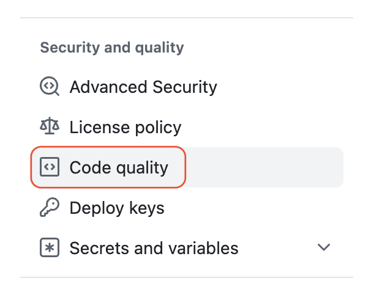
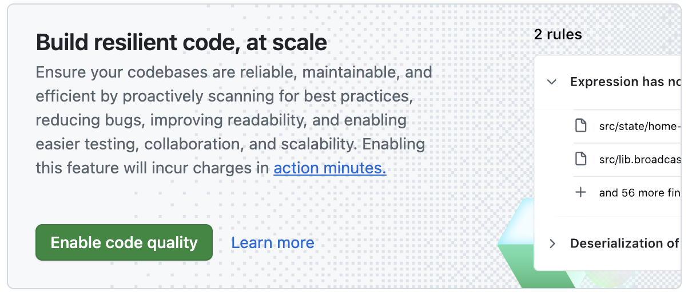
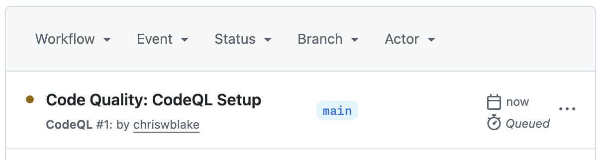
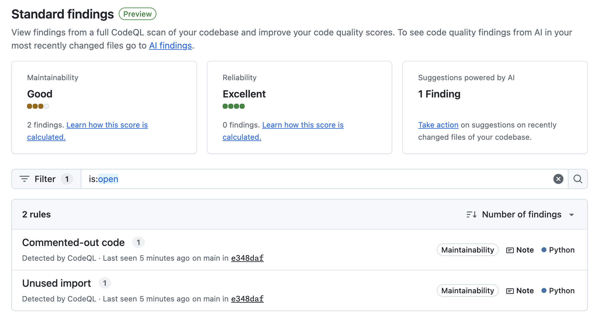
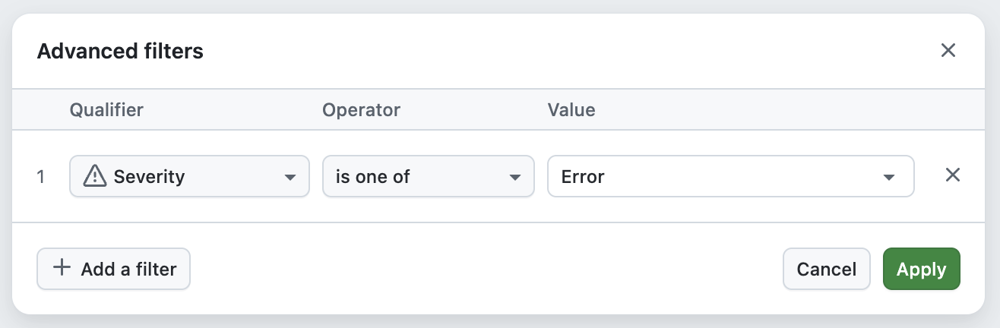

## Step 1: Enable Code Quality

You are reviewing student complaints about missing enrollments, over-capacity registrations, and duplicate signups in the Mergington High activities site. Before fixing any code, you need to see what the repository's quality signals are reporting today.

### 📖 Theory: Quality Insights

Code Quality gives you maintainability and reliability findings directly in your repository.

- Enabling Code Quality starts an analysis workflow on the default branch.
- Findings are displayed in the **Security** tab under **Code quality**, grouped into **Standard findings** and **AI findings**, and can be filtered by severity or category.
- **Standard findings** are produced by static analysis rules (e.g., CodeQL) and surface common reliability and maintainability issues across the codebase.
- Reviewing findings first helps your team focus on the highest-risk problems before making changes.

> [!NOTE]
> Code Quality scans consume GitHub Actions minutes. Review billing details here: https://docs.github.com/en/billing/concepts/product-billing/github-code-quality

Read more:

- https://docs.github.com/en/code-security/how-tos/maintain-quality-code
- https://docs.github.com/en/code-security/how-tos/maintain-quality-code/enable-code-quality
- https://docs.github.com/en/code-security/how-tos/maintain-quality-code/interpret-results

### ⌨️ Activity: Enable Code Quality

1. Open another browser tab and navigate to this exercise repository.

1. In the top navigation, select the **Settings** tab.

   

1. In the left sidebar, find and select **Code quality**.

   

1. At the top of the page, select the **Enable** button.

   

1. Wait for the initial scan of the default branch to finish. This can take a few minutes.

   > 💡 **Tip:** You can monitor progress by selecting the **Actions** tab in the top navigation.

   

1. As the **Code Quality** analysis runs, Mona will detect it and prepare the next step. Continue to the next activity while the scan completes.

Having trouble? 🤷
 

- If you do not see the **Code quality** option, your account may not have access to the feature. Please [check your availability](https://docs.github.com/en/code-security/concepts/about-code-quality#availability-and-usage-costs).
- If the scan does not start, refresh the settings page and confirm the **Enable** button was selected.

### ⌨️ Activity: Preview Standard Findings

Reviewing the initial findings gives your team a shared picture of what needs attention before making any code changes.

1. In the top navigation, select the **Security** tab.

1. In the left navigation, find the **Code quality** section and select **Standard findings**. Take a moment to review the results of this initial setup.

   

1. Try using the **Filter** bar to search the list of findings, for example by **Severity** or **Category**.

   

Having trouble? 🤷
 

- If findings are still loading, refresh the page after the initial scan completes.
- If the **Security** tab shows nothing under **Code quality**, confirm the analysis workflow finished in the **Actions** tab.

