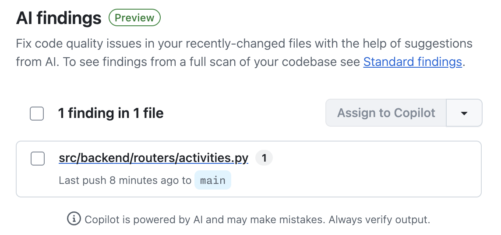

## Step 2: AI Findings

Standard findings identified structural issues in the codebase. Now it is time to learn about AI findings and start fixing one of the problems they uncovered.

### 📖 Theory: AI Feedback As You Work

AI findings complement standard static analysis with context-aware insights that catch subtler issues.

- **AI findings** appear in the **Security** tab under **Code quality** > **AI findings**.
- Unlike standard findings which run only on the default branch, AI findings update as you work — results appear on pushes to `main` **and** on pull requests that target `main`.
- This means your team gets feedback on new code before it merges, making AI findings a continuous quality signal throughout the development workflow.
- AI findings can surface issues such as logic errors, security anti-patterns, and code that is technically valid but likely unintentional.

Read more:

- https://docs.github.com/en/code-security/how-tos/maintain-quality-code/interpret-results

### ⌨️ Activity: Start Fixing A Quality Issue

The `login()` function in `auth.py` has three quality issues flagged by the standard analysis scan. You will fix all three, add a test, and open a pull request so AI findings can start running on the changed file.

- it contains a meaningless identical-operands check (`username == username`)
- it has an overly-broad `except` that returns a different response shape on error
- it has a duplicated `return` block that can never be reached

1. In the top navigation, select the **Code** tab and make sure you are on the `main` branch.

1. Create a branch named `fix-auth-quality-issues`.

1. Open the file `src/backend/routers/auth.py`.

1. Find the `login()` function and locate the current problematic code block:

   ```python
   teacher = teachers_collection.find_one({"_id": username})

   try:
       if username == username:
           pass

       if not teacher or not verify_password(teacher.get("password", ""), password):
           raise HTTPException(status_code=401, detail="Invalid username or password")
   except Exception:
       return {"error": "authentication failed"}

   response = {
       "username": teacher["username"],
       "display_name": teacher["display_name"],
       "role": teacher["role"]
   }

   return response

   return {
       "username": teacher["username"],
       "display_name": teacher["display_name"],
       "role": teacher["role"]
   }
   ```

1. Replace it with the corrected version:

   ```python
   teacher = teachers_collection.find_one({"_id": username})

   if not teacher or not verify_password(teacher.get("password", ""), password):
       raise HTTPException(status_code=401, detail="Invalid username or password")

   return {
       "username": teacher["username"],
       "display_name": teacher["display_name"],
       "role": teacher["role"]
   }
   ```

1. Open `tests/backend/routers/test_auth.py` and remove the `@pytest.mark.skip` decorator from `test_login_rejects_invalid_password` so the test runs again:

   Before:

   ```python
   @pytest.mark.skip(reason="Temp. Will fix later. (classic mistake)")
   def test_login_rejects_invalid_password():
   ```

   After:

   ```python
   def test_login_rejects_invalid_password():
   ```

1. Commit these changes to the `fix-auth-quality-issues` branch with a message like `fix: auth login quality issues`.

1. In the top navigation, select the **Pull requests** tab. Start a new pull request to merge your branch into `main`.
   - **base**: `main`
   - **compare**: `fix-auth-quality-issues`

1. Once the pull request is open, Mona will detect it and prepare the next step.

<details>
<summary>Having trouble? 🤷</summary><br/>

- Make sure the branch is named exactly `fix-auth-quality-issues`.
- Confirm the pull request targets the `main` branch.

</details>

### ⌨️ Activity: Preview AI Findings

With the pull request open, the Code Quality analysis runs on the `fix-auth-quality-issues` branch and produces AI findings for the changed file.

1. Wait for the Code Quality analysis to complete on the pull request. You can monitor progress in the **Checks** section of the pull request or in the **Actions** tab.

1. In the top navigation, select the **Security** tab.

1. In the left navigation, find the **Code quality** section and select **AI findings**.

   

1. Review the AI findings. Notice how they surface context-specific issues in the code you are actively working on, giving you feedback as you develop rather than after a merge.

<details>
<summary>Having trouble? 🤷</summary><br/>

- If AI findings are not yet visible, wait a few minutes for the analysis to complete and then refresh the page.
- If the **Security** tab shows nothing under **Code quality**, confirm the Code Quality feature is still enabled in **Settings**.

</details>
