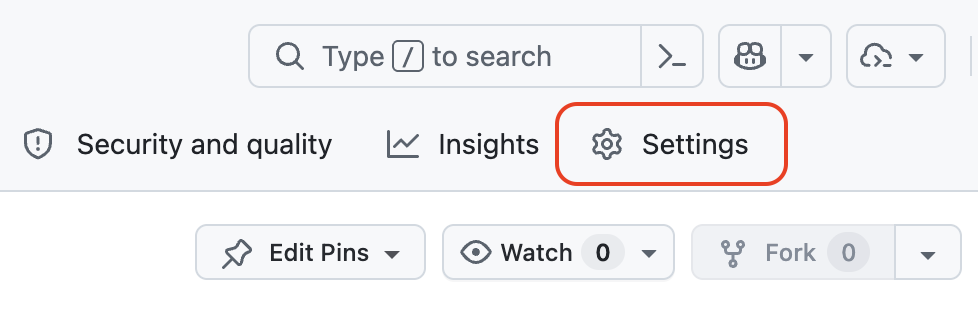
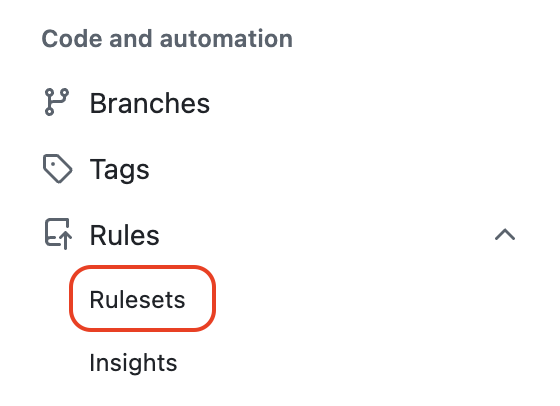
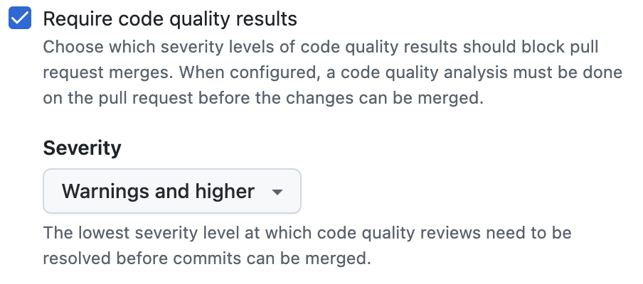
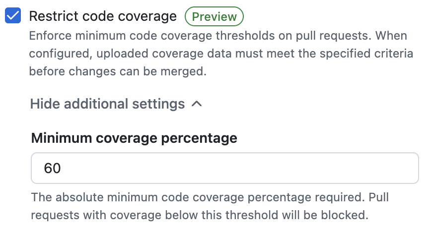

## Step 3: Enforce Quality And Coverage With Rulesets

Visibility alone did not prevent risky code from merging under deadline pressure. Now you turn the quality and coverage signals into branch policy, then confirm your fix satisfies that policy before merging.

### 📖 Theory: From Signals To Policy

Rulesets turn advisory checks into enforceable merge standards.

- Quality severity thresholds can block pull requests when unresolved findings exceed team limits.
- Coverage restrictions can prevent merges when coverage drops too far.
- Applying a ruleset to an open pull request requires its checks to pass before the pull request can merge.

Read more:

- https://docs.github.com/en/code-security/how-tos/maintain-quality-code/set-pr-thresholds
- https://docs.github.com/en/code-security/how-tos/maintain-quality-code/restrict-code-coverage
- https://docs.github.com/en/code-security/how-tos/maintain-quality-code/unblock-your-pr
- https://docs.github.com/en/repositories/configuring-branches-and-merges-in-your-repository/managing-rulesets/about-rulesets

## ⌨️ Activity: Enable rulesets

1. In the top navigation, select the **Settings** tab.

   

1. In the left sidebar, expand **Rules** and select **Rulesets**.

   

1. Click the **New ruleset** button and select the **New branch ruleset** option.

   

1. Use the following details and selected options.
   - **Ruleset Name**: `Quality and Coverage`
   - **Enforcement status**: `Active`.
   - **Target branches**: `Include default branch`

1. Enable **Require code quality results**. Set the severity threshold to `Warnings and higher`.

   

1. Enable **Restrict code coverage**. Set the **Minimum coverage percentage** to `60`

   

1. Scroll to the bottom and select **Create** to save the ruleset.

Having trouble? 🤷
 

- Make sure the target includes the default branch (`main`).
- If checks are not blocking later, confirm the enforcement status is `Active`.

## ⌨️ Activity: Confirm fixed quality issue and merge

Your ruleset now applies to the remediation pull request you opened in the previous step. Confirm the checks pass and complete the merge.

1. Open the **Pull requests** tab and select your `fix-signup-validation-bugs` pull request.
1. Because the ruleset is `Active`, the pull request cannot merge until the code quality and coverage checks pass. Wait for the checks to finish.
1. Confirm the checks pass, showing the quality issue is resolved and coverage meets the threshold.

   > 💡 **Tip:** If a check re-runs is needed, open the failed check to see which finding remains, fix it on the same branch, and commit again.

1. Once all checks pass, select **Merge pull request** and confirm.
1. Mona will detect the merge and wrap up the exercise.

Having trouble? 🤷
 

- If a check still fails, open the failed check to see which finding remains, fix it, and commit again.
- Make sure your branch is named exactly `fix-signup-validation-bugs` so the exercise can detect the merge.

